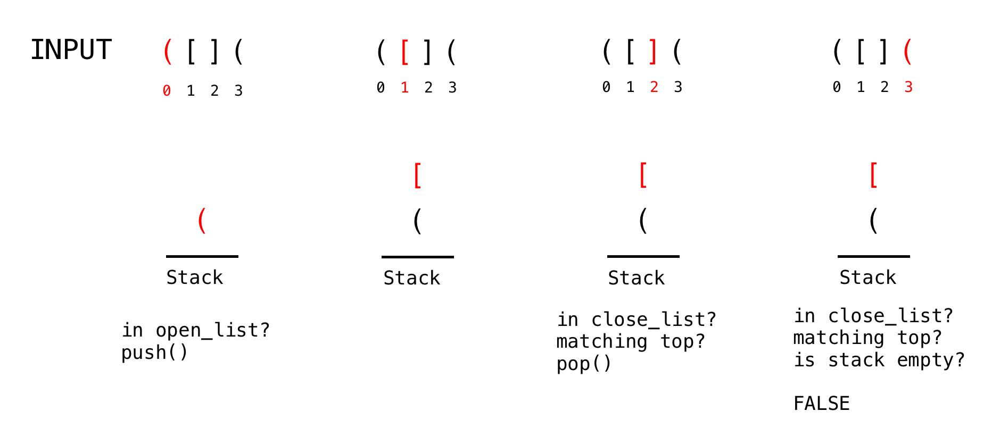

## Sample Exercise
Matching Parentheses

## Context
Mismatched parentheses or brackets are one of the most common syntax errors when programming in Python. They're easy to forget and deviously hard to find with the naked eye, especially in longer chunks of code. 

For example, the following snippet has a print statement at the bottom, missing a closing parenthesis:


In this exercise you will write a function to to check whether a String has balanced parentheses or not. Balanced means that each opening parenthesis is followed by a closing parentheses, and that they are appropriately nested. The same goes for brackets. 

You'll create this function using a `Stack` and here are some examples:

```
Input : [[()]]
Output : Balanced

Input : ([][]((
Output : Unbalanced

Input : )][(
Output : Unbalanced
```
Solving this with a Stack is easy:
* As you step through the string
* you push every open parenthesis on the stack
* If you encounter a closing parenthesis
* you check if it matches the one at the top of the stack
* if it does
every time I see an open parenthesis, I push it on the stack. If I find a closing parenthesis, I check if it matches the last opening one. If it matches, we pop the last item, the open parenthesis, off the stack. When we come to the end of the String, we should have no elements left, otherwise, the String is not balanced.

Here's an example:

```
open_list = [“(“, “[“]
close_list = [“)“, “]“]
```




## Instructions

* `stack`  is already defined as your Stack structure, along with  `open_list`  and  `close_list` as above.
    * blabla
    * blabla
    


## Solution
```
def is_balanced(str):
    for c in str:
        if stack.is_empty:        
            if char in open_list:
                stack.push(c)
            elif char in close_list:
                return false
        else:
            if stack.peek().matches(c):
                stack.pop()
            elif char in open_list:
                stack.push(c)
    return stack.is_empty
}
```

## Learning Objective Asessed
Learner will be able to solve common algorithmic problems using Stacks
