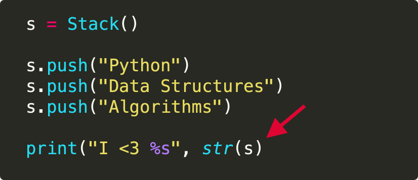

## Sample Exercise
Matching Parentheses

## Context
Mismatched parentheses, brackets or quotes are one of the most common syntax errors when programming in Python. They're easy to forget and deviously hard to find with the naked eye, especially in longer chunks of code. 

For example, the following snippet has a print statement at the bottom, missing a closing parenthesis:



You've undoubtedly been frustrated with them yourself. But, no more!

In this exercise you will

```
Input : {[]{()}}
Output : Balanced

Input : [{}{}(]
Output : Unbalanced
```


## Instructions

## Solution

## Hint

## Learning Objective Asessed
Learner will be able to solve common algorithmic problems using Stacks
