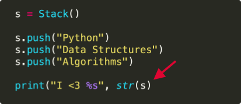

## Sample Exercise
Matching Parentheses

## Context
Mismatched parentheses or brackets are one of the most common syntax errors when programming in Python. They're easy to forget and deviously hard to find with the naked eye, especially in longer chunks of code. 

For example, the following snippet has a print statement at the bottom, missing a closing parenthesis:



In this exercise you will write a function to check whether a String has balanced parentheses or not. Balanced means that each opening parenthesis is followed by a closing parentheses, and that they are appropriately nested. The same goes for brackets. 

Here are some examples:

```
Input : [[()]]
Output : Balanced

Input : ([][]((
Output : Unbalanced

Input : )][(
Output : Unbalanced
```

Let's walk through it how to solve this with a Stack with some visual examples:

```
open_list = [“(“, “[“]
close_list = [“)“, “]“]
```


## Instructions

* `stack`  is already defined as your Stack structure, along with  `open_list` , a list of openening strings and  `close_list`, a list of closing strings.
* Complete the `if`  and  `elif`  outcomes, if the  `stack` is empty.
* Fill in the outcomes if  `stack` is not empty, and  `c` matches the top of the stack, via `stack.peek()`.
* Finally, add how we check whether the parentheses are matched at the end of the loop.
    
## Solution
### First Step
```
def is_balanced(str):
    for c in str:
        if stack.is_empty:        
            if c in open_list:
                ____
            elif c in close_list:
                ____
        else:
            if stack.peek().matches(c):
                ____
            elif c in open_list:
                ____
    return ____
}
```

### Second Step
```
def is_balanced(str):
    for c in str:
        if stack.is_empty:        
            if c in open_list:
                stack.push(c)
            elif c in close_list:
                return false
        else:
            if stack.peek().matches(c):
                ____
            elif c in open_list:
                ____
    return ____
}
```

### Third Step
```
def is_balanced(str):
    for c in str:
        if stack.is_empty:        
            if c in open_list:
                stack.push(c)
            elif c in close_list:
                return false
        else:
            if stack.peek().matches(c):
                stack.pop()
            elif c in open_list:
                stack.push(c)
    return ____
}
```

### Last Step
```
def is_balanced(str):
    for c in str:
        if stack.is_empty:        
            if c in open_list:
                stack.push(c)
            elif c in close_list:
                return false
        else:
            if stack.peek().matches(c):
                stack.pop()
            elif c in open_list:
                stack.push(c)
    return stack.is_empty
}
```

## Learning Objective Asessed
Learner will be able to solve common algorithmic problems using Stacks
